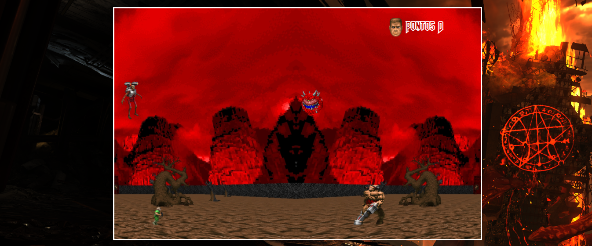

# SHOOTER EM 2D
🎮ESSE JOGO É UM TÍPICO EXEMPLO DE UM SHOOTER EM 2D, COM OBJETIVO DE PONTUAR O MÁXIMO POSSÍVEL ENQUANTO SOBREVIVE.

  

## DESCRIÇÃO:
Nele, você controla um personagem *Revenant* em um ambiente de combate onde deve atirar em inimigos, desviar de ataques e resgatar amigos. A pontuação aumenta ao derrotar inimigos e salvar aliados, mas diminui ao sofrer dano ou perder aliados. A energia do jogador é limitada, e o jogo termina quando ela chega a zero.

## COMO JOGAR?
1. **Controles**:
   - **Movimento**:
     - **Teclas W/A/S/D** ou **Setas direcionais**: movimentam o personagem para cima, baixo, esquerda e direita.
   - **Ataque**:
     - **Barra de espaço**: dispara projéteis contra os inimigos.
2. **Objetivos**:
   - Derrote os inimigos atirando neles.
   - Salve os aliados que aparecem na tela.
   - Evite colisões com inimigos para não perder energia.
3. **Mecânicas de Jogo**:
   - Os inimigos se movem da direita para a esquerda, e o jogador deve esquivar ou atirar para derrotá-los.
   - O aliado move-se da esquerda para a direita; encoste nele para resgatá-lo.
   - A cada inimigo derrotado ou aliado salvo, sua pontuação aumenta.
4. **Dificuldade**:
   - A velocidade dos inimigos aumenta gradativamente, tornando o jogo mais desafiador.
5. **Final do Jogo**:
   - O jogo termina quando a energia do jogador chega a zero.
   - Um placar final é exibido com a pontuação, e há a opção de reiniciar o jogo.
   - Ao término do jogo, é possível clicar em **"Jogar Novamente"** para reiniciar a partida e começar do zero.

## NÃO SABE?
- Entendemos que para manipular arquivos em `HTML`, `CSS` e outras linguagens relacionadas, é necessário possuir conhecimento nessas áreas. Para auxiliar nesse aprendizado, oferecemos cursos gratuitos disponíveis:
* [CURSO DE HTML E CSS](https://github.com/VILHALVA/CURSO-DE-HTML-E-CSS)
* [CURSO DE JAVASCRIPT](https://github.com/VILHALVA/CURSO-DE-JAVASCRIPT)
* [CURSO DE JQUERY](https://github.com/VILHALVA/CURSO-DE-JQUERY)
* [CONFIRA MAIS CURSOS](https://github.com/VILHALVA?tab=repositories&q=+topic:CURSO)

## CREDITOS:
- [PROJETO CRIADO PELO "mfmuzi"](https://github.com/mfmuzi/DOOM)
- [PROJETO EDITADO PELO VILHALVA](https://github.com/VILHALVA)
